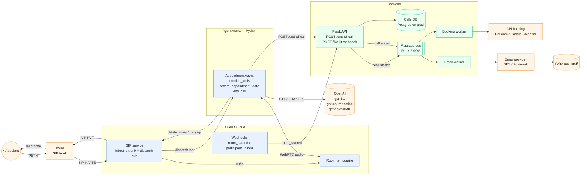
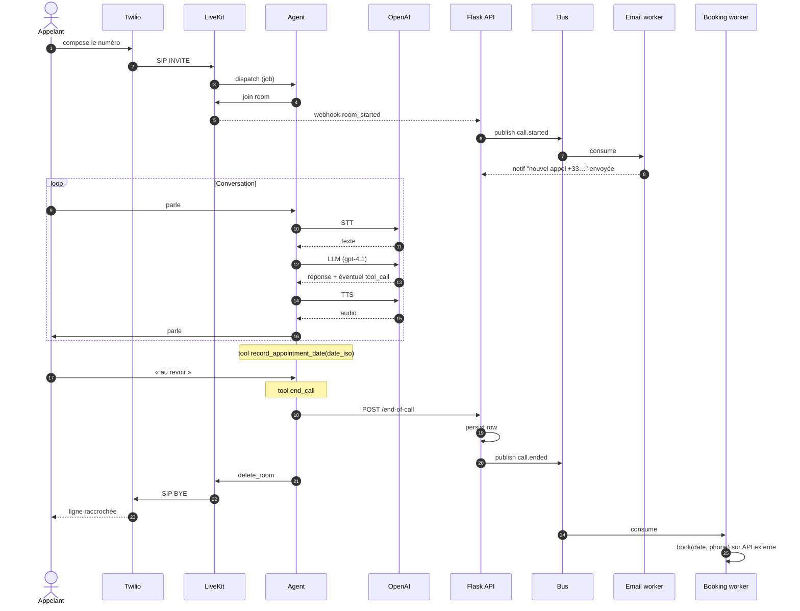

# Architecture (Partie 2)

Vue d'ensemble du système couvrant le brief :

- prise de rendez-vous via une **API externe** déclenchée par la demande client,
- **notification email** à chaque nouvel appel entrant.

L'idée directrice : pendant l'appel on reste sur le **chemin temps-réel** (LiveKit + LLM), tout ce qui n'a pas besoin d'être synchrone (booking, email, audit) part sur un **chemin asynchrone** déclenché par des événements. Ça isole la latence vocale du reste et permet de retry sans perturber l'appelant.

## 1. Vue système

## 2. Chronologie d'un appel

## 3. Choix d'architecture

| Décision | Raison |
| --- | --- |
| **Booking en async, hors session vocale** | La prise de RDV externe peut prendre 1-3 s. À ce délai, l'appelant attend ou raccroche. On confirme oralement la date pendant l'appel ; le booking effectif part dans le bus et est rejoué si l'API externe est down. |
| **Email via webhook LiveKit `room_started`** | Source de vérité côté LiveKit (un appel = une room). Pas besoin pour l'agent worker de notifier en plus, ce qui éviterait les double-notifs si le worker crash après le premier message. |
| **Bus de messages entre l'API et les workers** | Découplage classique : retry, dead-letter, scaling indépendant des workers booking/email. En MVP on peut commencer avec une simple table `outbox` SQL polling-based avant de sortir Redis/SQS. |
| **Stocker `appointment_raw` en plus du `appointment_date` ISO** | Audit. Si la normalisation LLM date ISO se trompe, on peut rejouer à partir du texte original. |
| **Hangup via `delete_room`** | Force LiveKit à envoyer SIP BYE sur le trunk, donc le téléphone de l'appelant raccroche réellement. C'est l'API documentée pour terminer une session côté serveur. |
| **`participant_disconnected` sur le worker** | Si l'appelant raccroche en premier, on persiste quand même l'appel. L'idempotence est garantie par `room_name UNIQUE` côté DB + un flag local côté agent. |

## 4. Ce qui change en prod par rapport au MVP livré

- **Postgres** au lieu de SQLite (SQLite est OK pour le test mais 1 writer/many readers en prod c'est limite).
- **Bus de messages réel** (Redis Streams / SQS) au lieu d'appels HTTP synchrones depuis l'API.
- **Workers séparés** (booking, email, transcription) déployés indépendamment.
- **Auth signée** sur le webhook LiveKit (`Authorization: Bearer <token>`) et sur `/end-of-call` (HMAC partagé entre l'agent et l'API).
- **Observabilité** : logs structurés (JSON), traces OpenTelemetry, métriques sur la latence STT→LLM→TTS et sur le taux de RDV captés.
- **Numéro Twilio + dispatch rule** par locataire si on multi-tenant.
